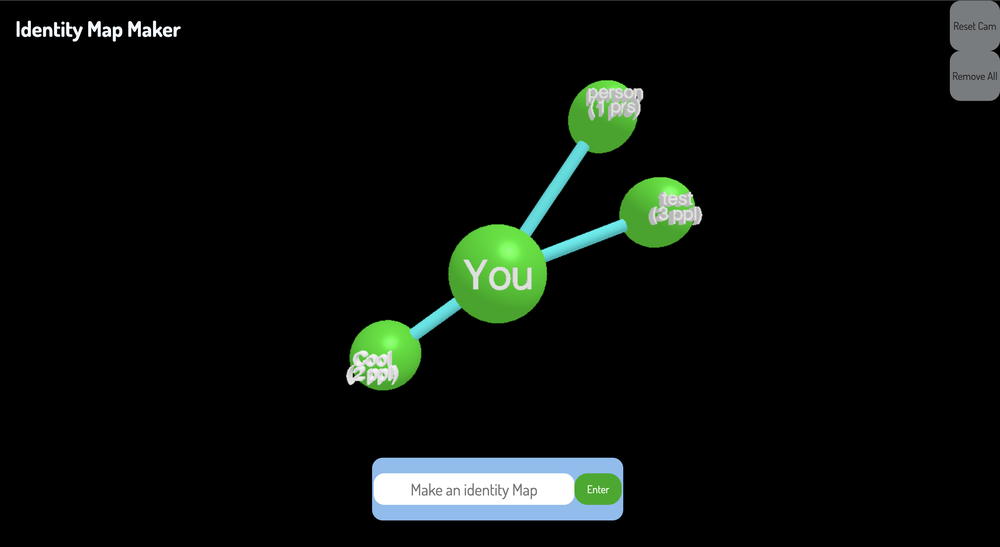

# Identity Map Maker

A browser-based 3D “identity map” built with Three.js and Firebase. Type the words or labels that describe you, watch them appear as spheres orbiting a central “You” node, and see their sizes reflect how many people have chosen the same words.

## Features

-   Interactive 3D graph with orbit controls and a reset button for quick recentering.
-   Central “You” bulb plus user-added bulbs linked by animated tubes that stay connected as you move things around.
-   Dictionary/identity validation for inputs; prevents duplicate entries in the current map.
-   Bulb radius scales with the global popularity of each word (counts stored in Firebase) and updates live with a pop-in animation.
-   Click-and-drag positioning on a 2D plane; positions auto-save to localStorage and restore on reload.
-   “Remove All” resets the local map and clears saved positions; periodic sync keeps bulb sizes aligned with the latest Firebase data.

## Demo

